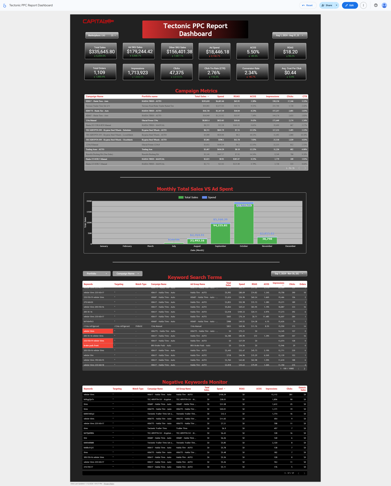

# Amazon PPC Manager

A comprehensive Amazon PPC (Pay-Per-Click) management tool for Sponsored Products campaigns. Upload your Amazon Advertising reports, analyze performance, identify optimization opportunities, and generate bulk upload files.



## Features

### 📊 Dashboard
- **KPI Overview**: Total sales, ad spend, ROAS, ACOS, orders, impressions, clicks, CTR, conversion rate, and average CPC
- **Campaign Performance Table**: Compare all campaigns at a glance
- **Monthly Trends**: Visualize sales and spend over time

### 🔍 Search Term Analysis
- **Negative Keyword Discovery**: Find wasteful search terms to add as negatives
- **Bleeding Spend Detection**: Identify search terms with high spend but no sales
- **High ACOS Analysis**: Find root causes of poor performance (Low CTR, High CPC, Low CVR)
- **Scale Opportunities**: Discover high-performing terms to bid up

### 🚀 Auto Campaign Generator
- Generate Amazon-compliant bulk upload files for new Auto campaigns
- Support for all targeting types (close-match, loose-match, substitutes, complements)
- **SKU input per ad group** - Add multiple products to advertise
- **Placement bid adjustments** - Top of Search, Product Pages, Rest of Search percentages
- Individual bid overrides per targeting type

### ❌ Negative Keyword Export
- Export negative keywords directly from analysis results
- Support for both Negative Exact and Negative Phrase match types
- Bulk file generation compatible with Amazon Ads Console

### ✅ PPC Checklist
- Interactive checklist for PPC optimization tasks
- Track progress on campaign management activities

## Tech Stack

- **Frontend**: Next.js 14, React, TypeScript, Tailwind CSS
- **Backend**: Python 3.11+, FastAPI, Pandas
- **Data Processing**: OpenPyXL for Excel file handling

## Getting Started

### Prerequisites

- Node.js 18+ and npm
- Python 3.11+
- pip (Python package manager)

### Installation

1. **Clone the repository**
   ```bash
   git clone https://github.com/yourusername/amazon-ppc.git
   cd amazon-ppc
   ```

2. **Install backend dependencies**
   ```bash
   cd backend
   pip install -r requirements.txt
   ```

3. **Install frontend dependencies**
   ```bash
   cd frontend
   npm install
   ```

### Running the Application

**Option 1: Use the batch file (Windows)**
```bash
run_app.bat
```

**Option 2: Manual startup**

Terminal 1 - Backend:
```bash
cd backend
uvicorn main:app --reload --port 8000
```

Terminal 2 - Frontend:
```bash
cd frontend
npm run dev
```

Then open [http://localhost:3000](http://localhost:3000) in your browser.

## Usage

1. **Upload Report**: On the dashboard, upload an Amazon Search Term Report (Excel/CSV)
2. **View Dashboard**: See aggregated KPIs and campaign performance
3. **Run Analysis**: Go to Analysis page to identify negative keywords and optimization opportunities
4. **Generate Campaigns**: Use the Auto Campaign Generator to create new campaigns
5. **Export Bulk Files**: Download bulk upload files for Amazon Ads Console

## Project Structure

```
amazon-ppc/
├── backend/
│   ├── main.py              # FastAPI application entry point
│   ├── routers/             # API endpoints
│   │   ├── upload.py        # File upload handling
│   │   ├── analysis.py      # Search term analysis
│   │   └── export.py        # Bulk file generation
│   ├── services/            # Business logic
│   │   ├── campaign_generator.py  # Auto campaign bulk file creation
│   │   └── decision_center.py     # Analysis algorithms
│   └── models/
│       └── schemas.py       # Pydantic models
├── frontend/
│   ├── src/app/
│   │   ├── page.tsx         # Dashboard
│   │   ├── analysis/        # Search term analysis page
│   │   ├── campaigns/       # Auto Campaign Generator
│   │   ├── negatives/       # Negative keyword management
│   │   └── checklist/       # PPC checklist
│   └── src/lib/
│       └── api.ts           # API client functions
└── run_app.bat              # Quick start script (Windows)
```

## Amazon Bulk File Format

The Auto Campaign Generator creates Excel files compatible with Amazon's Sponsored Products bulk upload format:

| Column | Description |
|--------|-------------|
| Product | Always "Sponsored Products" |
| Entity | Campaign, Ad Group, Product Ad, Bidding Adjustment, Product Targeting |
| Operation | Create, Update, or Delete |
| Campaign ID | Text-based identifier for new campaigns |
| Ad Group ID | Text-based identifier for new ad groups |
| Campaign Name | Display name of the campaign |
| State | enabled, paused, or archived |
| Daily Budget | Campaign daily budget |
| SKU | Product SKU for Product Ad entities |
| Placement | Placement type for bid adjustments |
| Percentage | Bid adjustment percentage (0-900%) |

## Contributing

Contributions are welcome! Please feel free to submit a Pull Request.

## License

This project is for personal/educational use. 

---

Built with ❤️ for Amazon PPC advertisers
